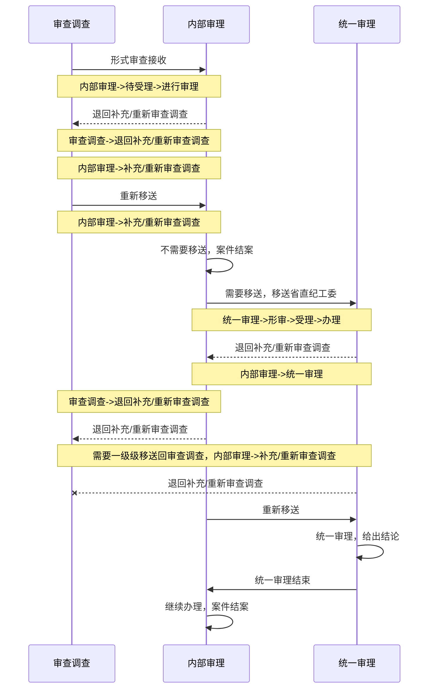

# **派驻v1.0概要设计**
>author : 孙文浩

>version : v1.0

>date : 2020-3
---
## 目录
- [1.系统流程概述](#1.系统流程概述)
    - [1.1.相关业务模块](#1.1.相关业务模块)
    - [1.2.数据流程](#1.2.数据流程)
    - [1.3.数据权限](#1.3.数据权限)
    - [1.4.功能权限](#1.4.功能权限)
- [2.功能模块划分](#2.功能模块划分)
    - [2.1.A5部分](#2.1.A5部分)
    - [2.2.A6部分](#2.2.A6部分)
- [3.数据库设计](#3.数据库设计)
    - [3.1.DDL](#3.1.DDL)
    - [3.2.DML](#3.2.DML)
- [4.附录](#4.附录)

---
## 1.系统流程概述

### 1.1.相关业务模块
- 立案审查调查
- 内部审理
- 统一审理
### 1.2.数据流程



### 1.3.数据权限
>基于派驻已有数据权限，此节点只描述内部审理与统一审理的数据权限区分
- 内部审理数据权限
    - 原数据权限+（移送省直纪工委标识）
- 统一审理数据权限
    - 借用内部审理数据权限+（移送省直纪工委标识）
    - 主页面sql参照权限字修改，基于原内部审理sql修改
- 标识字段解释
    - c_sfys:是否移送  
        - 1：是，需要移送
        - 2：否，不需要移送
    - c_tyslzt：统一审理状态    
        - 0：统一审理待接收
        - 1：统一审理中
        - 2：统一审理退回(补充/重新)
        - 3：统一审理形审退回
        - 4：统一审理完成
        - 5：统一审理待受理
        - 6：统一审理待分配承办人
        - 7：内部审理退回(补充/重新)
        - 8：立案审查销案
        - 11：结案
        - 12：内部审理补充/重新审查重新移送
        - 13：审查调查补充/重新审查重新移送
        - 14：终止
        - 15：重新审查调查重新移送
        - 16：内部审理重新审查调查重新移送

---

### 1.4.功能权限
- 内部审理保持不变
- 统一审理参照权限字梳理文档，在dev_tools上配置对应权限字

## 2.功能模块划分
### 2.1.A5部分
- **主界面构建**
  - 分配承办人
    - 承办人办案表增加字段“是否统一审理分配”c_sftyslfp，一个案件审理记录，在统一审理退回时，需要退回内部审理原承办人，这时需要区分统一审理分配的承办人和内部审理分配的承办人

  - t_zhbaz_zjmpz_ajlb（已配置好，需修改链接页面）
    - 已配置的c_url链接页面，替换成新的ajxs表中的新记录，新记录基于内部审理原记录改造
  - t_zhba_zjmpz_ajxs
    - 针对同一审理，copy一份内部审理的配置，挂接ajlb表配置，具体查询逻辑，依据具体模块改造（增加查询过滤条件）
- **审查调查**
  - 前提条件：移送过了统一审理，销案时，需要在原有更新操作中，增加c_tyslzt=8的更新
  - 前提条件：移送过了统一审理，结案时，需要在原有更新操作中，增加c_tyslzt=11的更新
  - 统一->内部->审查调查重新移送，更新c_tyslzt=13
- **内部审理**
    - 形式审查
        - 列表数据查询暂无修改
        - 形式审查保存增加c_xssclx=1
    - 进行审理
        - 审理中案件
            1. 列表查询条件增加条件字段，c_tyslzt=null
            2. 审批记录，参照t_zhba_sp表，审批详情参考表中审批详情字段（需新增c_spxqurl）
        - 补充/重新调查
            1. 列表数据查询暂无修改
            2. 办理操作同审理中案件
            3. 原退回逻辑不变，省直纪工委退回的数据增加查询条件 or c_tyslzt=13
        - 申请复查案件
            1. 隐藏模块，暂不做
        - 统一审理
            1. 查询sql参考审理中案件tab，c_tyslzt in (1,2,3,4)
            2. 状态列参照c_tyslzt
    - 已结案
        - 查询增加标识字段作为条件，or c_tyslzt=11
    - 立案审查调查已终止/销案
        - 查询增加标识字段作为条件，or c_tyslzt=8
- **统一审理**
    - 形式审查
        - 形式审查
            1. 形式审查通过，审批通过，ajsl.c_tyslzt=1，sp.c_dqzt=2
            2. 形式审查通过，审批不通过，sp.c_dqzt=3
            3. 形式审查不通过，审批通过，ajls.c_tyslzt=3,sp.c_dqzt=2
            4. 形式审查不通过，审批不通过，sp.c_dqzt=3
            5. 更新t_zhba_ajsl_xsjl.c_xssclx=2
        - 形式审查审批：
           1. 受理案件形式审核表，约定“勾选项字段”，在attachmenturl中带入数据（目前可能无数据）
        - 审批记录
            1. 审批详情，直接调用数据库审批表中的详情字段c_spxqurl
            2. 审批状态，对接审批mq更新进库中的状态，参照数据库单值代码
    - 案件受理
        - 审批记录
          1. 参照t_zhba_sp表，详情参考表中字段
          2. 增加案件受理表t_zhba_ajsl_ajsl，用于审批记录查询
        - 受理操作，更新c_tyslzt=5,c_ajjd
        - 再次受理，即审批退回，列表展示依据审批状态，该操作为再次提起审批
        - 列表状态列，参照需求中梳理的状态（该状态建立在审批状态上）
        - 受理审批通过后，更新c_tyslzt=6，展示分配承办人
        - 分配承办人后，更新c_tyslzt=1
    - 进行审理
        - 审理中案件
            1. 列表数据查询增加条件字段c_tyslzt=1
            2. 审批状态，对接审批mq更新进库中的状态，参照数据库单值代码 
        - 补充/重新调查
            1. 查询条件，c_tyslzt=2 or c_tyslzt=12
        - 申诉复查
            1. 隐藏暂不做
    
    - 已结案
        - 结案
            1. 结案列表查询条件增加（c_sfys=1 and c_tyslzt=11）
        - 统一审理结束
            1. 查询关注c_tyslzt=4
        - 立案审查调查已终止/销案
            1. 关注c_tyslzt=8
- **提前介入**
    - 介入申请批准
        - 增加内部审理省直纪工委提前介入的数据来源查询，依旧按照原来数据权限，通过部门区分
    - 指定审理组
        - 增加内部审理省直纪工委提前介入的数据来源查询，依旧按照原来数据权限，通过部门区分
    - 反馈结果
        - 增加内部审理省直纪工委提前介入的数据来源查询，依旧按照原来数据权限，通过部门区分
- **审批相关**
    - zjjdApi同步审批数据时，增加c_spxqurl的保存，该字段存在于审批mq消息中
    - 退回补充审查调查的审批，放在文书上审批（变为文书审批），审批bk区分“补充”和“重新”
    - 全局问题：审批区分派驻部门和省直纪工委，通过uim权限字控制所要走的审批流程
        - 区分2级还是3级：
                
                sfzcbr(是否主承办人，来自t_zhba_cbr_ba):
                1：是
                2：否
        - 区分派驻部门和省直纪工委
                
                sfszjgw(权限字，是否省直纪工委):
                  省直纪工委审批流程：1(jcw.pzxt.sp.szjgw)
                  派驻部门审批流程：2(jcw.pzxt.sp.pzbm)
        - 增加方式
        
              attachmenturl中，增加groupCondition：{"sfzcbr":"1","qxkey":"1"}

        - 区分文书审批还是事项审批：   
              business_key 中：   
                以"pzws"开头的为文书审批   
                以"pzsx"开头的为事项审批
        - 提请审批的修改
          1. 审批记录查询相关，提请审批时dataId=ywbh;ajbh
          2. 同步审批记录时，解析dataId，ywbh存c_tqnr，ajbh存c_ajbh
- **数据流转**
    - 数据流传节点参考流程图
    - 流转时的字段更新，参考已梳理的页面查询
### 2.1.A6部分
>前端定义接口，后端对应字段。见[4.附录](#4.附录)

- 区分“内部审理办理页面”和“统一审理办理页面”方式
    - 通过dkfs
        - dkfs=1:内部审理打开办理页面，下面两字段为主表字段（即基本信息字段）
            1. c_sfys=null or 2,c_tyslzt=null，左侧展示11个节点(3+8)
            2. c_sfys=1,c_tyslzt=-1,2,3,13，左侧展示9个节点
            3. c_sfys=1,c_tyslzt=4,左侧展示14个节点
        - dkfs=2:统一审理打开办理页面
            1. 左侧展示6个节点
- 接口定义：
    - 前端根据页面操作定义接口+字段中文含义
    - 后端根据字段中文含义，对上后台英文字段
- 左侧节点在内部审理和统一审理的可选范围区分方式
    - 根据c_sfys字段段
        - 1：移送
        - 2：不移送
- 模块功能梳理（具体操作已前端定义的接口为准），此处指出修改节点
    - 基本信息
        
        - 增加字段是否移送省直纪工委c_sfys
    - 审理谈话
        - 页面调整
        - 增加审批，dataId(c_tqnr)为行记录主键
        - 嵌入附件模块，以每条记录为单位，记录主键为嵌入附件url传参ywbh
        - 审批记录，参考数据库t_zhba_sp，详情用sp表中的c_spxqurl
        - 区分“派驻部门”和“省直纪工委”，审理谈话表增加字段c_sfys判断
            1. c_sfys:1,统一审理
            2. c_sfys:2,内部审理
    - 商请省直纪工委提前介入
        - 前端新增页面
        - 后端新增接口
        - 数据库对应表结构，t_zhba_tqjr增加字段
        - 提前计入类型，单值代码维护
    - 补充/重新审查
        - 退回补充审查表增加c_sfys，用作区分“派驻部门”和“省直纪工委”的退回
            1. c_sfys:1,统一审理
            2. c_sfys:2,内部审理
        - 文书
        1. 内部审理：
    
                    原文书模板配置
        2. 统一审理
    
                    新增文书模板配置
        - 退回阶段判断
        1. 阶段参数解释
               
                  c_thlx=1:统一审理退回
                  c_thlx=2:内部审理退回
        - 审批：
        1. 内部审理：
    
                    补充审查调查pzws_nbsl_bcscdc
                    重新审查调查pzws_nbsl_cxscdc
        2. 统一审理
    
                    补充审查调查：pzws_tysl_bcscdc
                    重新审查调查：pzws_tysl_cxscdc
            3. t_zhba_splc_config中配置（修改+新增）文书审批
    - 延长审理时限
        - 数据区分“内部审理”和“统一审理”，通过c_sfys
            1. c_sfys:1,统一审理
            2. c_sfys:2,内部审理
        - 页面重做
        - 后台接口重写
        - 嵌入附件模块，记录主键作为ywbh
        - 审批有相关校验
        - 延长次数做成配置，配置到application.yml中
    - 审理结论
        
        - 事项记录模块如果有，先隐藏
    - 移送省直纪工委
        - 此模块涉及数据流转，更新字段c_tyslzt=0
        - 关于留置措施的时间问题，需要对接dccs服务

---

## 3.数据库设计
### 3.1.DDL
>单值代码：vc100，正常string字段vc300、vc600、vc900，富文本（过长字符串）text
- 表结构修改
    - **t_zhba_ajsl（已加）**
        |column|type|comment|
        |---|---|---|
        |c_sfys|varchar(100)|是否移送|
        |c_tyslzt|varchar(100)|统一审理状态|
        |c_nbslxaqr|varchar(100)|内部审理销案确认|
        |c_tyslxaqr|varchar(100)|统一审理销案确认|
        |d_ystyslrq|date|移送统一审理日期|
        |lc_tysljlbz|text|统一审理结论备注
        |d_tysljsrq|date|统一审理结束日期
        |c_tyslbm|varchar(300)|统一审理部门
        ---
        ---
    - **t_zhba_sp（已加）**
        |column|type|comment|
        |---|---|---|
        |c_spxqurl|text|审批详情url|
        ---
        ---
    - **t_zhba_tqjr（已加）**
        
        |column|type|comment|
        |---|---|---|
        |d_larq|timestamp|立案日期（冗余字段）|
        |c_xm|varchar(300)|被调查人姓名（冗余字段）|
        |d_csrq|timestamp|出生日期（冗余字段）|
        |c_gzdw|varchar(300)|工作单位（冗余字段）|
        |c_xzzw|varchar(300)|现职务（冗余字段）|
        |c_laay|varchar(300)|立案案由（冗余字段）|
        |c_sflz|varchar(100)|是否留置|
        |d_lzsj|timestamp|留置时间|
        |c_sfzjcj|varchar(100)|是否装订成卷|
        |c_ajsl|varchar(300)|案卷数量|
        |c_sfxcscdcbgcg|varchar(100)|是否形成审查调查报告初稿|
        |lc_zywjwfss|text|主要违纪违法事实|
        ---
        ---
    - **t_zhba_ajsl_slth（已加）**
        
        |column|type|comment|
        |---|---|---|
        |c_thlx|varchar(100)|谈话类型（1：统一 2：内部）|
        ---
        ---
    - **t_zhba_thbcsc（已加）**
        |column|type|comment|
        |---|---|---|
        |c_thlx|varchar(100)|退回类型|
        ---
        ---
    - **t_zhba_ajsl_xsjl（已加）**
        |column|type|comment|
        |---|---|---|
        |c_xssclx|varchar(100)|形式审查类型|
      
    - **t_zhba_cbr_ba**
        |column|type|comment|
        |---|---|---|
        |c_sftyslfp|varchar(100)|是否统一审理分配|   
    - **t_zhba_ycsx**   
        |column|type|comment|
        |---|---|---|
        |d_ybjrq|timestamp|原办结日期|
        |c_sllx|varchar(100)|审理类型|


- 新增表
    - **t_zhba_ajsl_ajsl**
        |column|type|comment|
        |---|---|---|
        |||主键|
        |||案件编号|
    - **t_zhba_ajsl_ysszjgw**
        |column|type|comment|
        |---|---|---|
        |c_bh|varchar(32)|主键|
        |c_ajbh|varchar(32)|案件编号|
        |d_ystyslrq|date|移送统一审理日期|
        |c_czr|varchar(300)|操作人
        |dt_cjsj|timestamp|创建时间
        |dt_zhgxsj|timestamp|最后更新时间
### 3.2.DML
- **t_aty_code**
    |c_pid|c_code|c_name|
    |---|---|---|
    |50000000|0	|统一审理待接收
    |50000000|1	|统一审理中
    |50000000|2	|统一审理退回(补充/重新)
    |50000000|3	|统一审理形审退回
    |50000000|4	|统一审理完成
    |50000000|5	|统一审理待受理
    |50000000|6	|统一审理待分配承办人
    |50000000|7	|内部审理退回(补充/重新)
    |50000000|8	|立案审查销案
    |50000000|11|	结案
    |50000000|12|	内部审理补充/重新审查重新移送
    |50000000|13|	审查调查补充/重新审查重新移送
    |50000001|1|审查调查申请提前介入|
    |50000001|2|商请检察机关提前介入|
    |50000001|3|商请省直纪工委提前介入|
    |50000002|1|内部审理形式审查|
    |50000002|2|统一审理形式审查|
    |50000003|1|统一审理退回|
    |50000003|2|内部审理退回|
    |50000004|3|统一审理形审案件状态|
    |45000762|	-1	|待审批
    |45000762|	0	|未读
    |45000762|	1	|审批中
    |45000762|	2	|审批结束
    |45000762|	3	|退回
    |45000762|	4	|撤回
    |45000762|	5	|退回后重新发起又进行了撤回
    |45000762|	6	|线下审批中
    |45000762|	7	|审批结束（不同意）
    |45000762|	8	|待选择审批人
    |45000762|	9	|已终止审批
    |45000762|	10	|转呈中
    ---
    ---
- **t_aty_codetype**
    |c_id|c_name|
    |---|---|
    |50000000|统一审理状态|
    |50000001|提前介入类型|
    |50000002|形式审查类型|
    |50000003|退回类型    |
    ---
    ---
- **t_zhba_splc_config**
    |文书名|审批bk|
    |---|---|
    |内部审理补充审查调查|pzws_nbsl_bcscdc|
    |内部审理重新审查调查|pzws_nbsl_cxscdc|
    |统一审理补充审查调查|pzws_tysl_bcscdc|
    |统一审理重新审查调查|pzws_tysl_cxscdc|

---

## 4.附录
back to A6部分[2.1.A6部分](#2.1.A6部分)
### 基本信息
> 请求基本数据
  * 接口：ajbl/slws/getSlqk
  * 响应数据：在data.data中添加“是否需要移送统一审理”字段

> 保存按钮点击之前需要【新加接口】
  * 作用：进行职级判断
  * 接口：
  * 响应数据：需要移送的，职级是：【县处级副职及以上】还是【县处级以下】；
             不需要移送的，职级是：【县处级副职以下】还是【县处级及以上】
  * 建议响应数据中只有一个字段：该字段只有在【需要移送 + 县处级以下】或者【不需要移送 + 县处级以上】的为true，其余都为false

> 保存基本数据
  * 接口：ajbl/slws/bc
  * 请求数据：在原来的基本上添加“是否需要移送统一审理”字段
  * 响应数据：不变           

### 补充/重新审查调查
> 相关文书模板 + 已制作文书
  * 作用：当前的相关模板 + 已制作文书 的展示内容 与 “退回形式”联动。
  退回形式为【退回审查调查】，文书模板展示【补充审查（调查）建议函】；
  退回形式为【重新审查调查】，文书模板展示【重新审查（调查）建议函】。
  * 接口：[文书模板]ajbl/slth/getWsmb [已制作文书]ajbl/slth/getWssl
  * 请求数据：需要后端加一些标识告知如何修改
  * 响应数据：不变

> 历史退回记录
  * 接口：ajbl/slws/lsthjl
  * 响应数据：添加字段“退回阶段”         

> 历史退回记录-操作列-查看-退回相关材料信息
  * 接口：确认是否沿用原来的附件材料模板
  * 响应数据：确保里面含有字段“分类”、“密级”、“材料名称”
---
### 商请省直纪工委提前介入
> 请求提前介入信息【新加接口】
  * 接口：
  * 请求数据：
  * 响应数据：
  ```json
  {
    "code":200,
    "data":{
      "派驻纪检监察组": "驻xx纪检监察组",
      "立案时间": "2020-03-12",
      "被审查调查人": "选中的人员id",
      "出生年月": "2019.02.11",
      "工作单位": "工作单位信息",
      "职务": "职务信息",
      "案由": "案由xxxxxx",
      "是否留置": "是否的单值代码",
      "留置时间": "2020-03-11",
      "是否装订成卷": "是否的单值代码",
      "案卷数量": 11,
      "是否形成审查调查报告初稿": "是否的单值代码",
      "主要违纪违法事实及倾向性意见": "111111",
      "提前介入原因": "eqweqewqewqeq",
      "审批开关状态": "审批开关是否打开",
      "审批状态": "未提起审批|审批中|审批不通过|审批通过"
    },
    "success":true
  }
  ```

> 提前介入信息 - 被审查调查人下拉数据
  * 接口：ajbl/slth/getOptionValue
  * 请求数据：固定一下dmlx对应标识
  * 响应数据：

> 提前介入信息 - 保存【新加接口】
  * 接口：
  * 请求数据：
  ```json
  {
    "派驻纪检监察组": "驻xx纪检监察组",
    "立案时间": "2020-03-12",
    "被审查调查人": "选中的人员id",
    "出生年月": "2019.02.11",
    "工作单位": "工作单位信息",
    "职务": "职务信息",
    "案由": "案由xxxxxx",
    "是否留置": "是否的单值代码",
    "留置时间": "2020-03-11",
    "是否装订成卷": "是否的单值代码",
    "案卷数量": 11,
    "是否形成审查调查报告初稿": "是否的单值代码",
    "主要违纪违法事实及倾向性意见": "111111",
    "提前介入原因": "eqweqewqewqeq"
  }
  ```
  * 响应数据： 保存成功、失败提示语以及标识


> 提前介入信息 - 提起审批【新加接口】
  * 接口：
  * 请求数据：
  * 响应数据： 校验后返回发起审批弹窗页面的url

> 附件材料信息
  * 接口：ajbl/slth/uploadFile
  * 请求数据：告知标识
  * 响应数据：不变
---
### 审理谈话
> 请求谈话记录数据
  * 接口：ajbl/slth/getSlthList
  * 响应数据：需要在data的数组对象中添加 1. “数据状态”，数据状态一共有：待审批、审批中、谈话中、审批退回、已撤回、审批不通过、终止审批、转呈中、谈话中、已结束；
             2. “当前记录的审批开关是否被打开”；
             3. “当前记录的审批记录链接”【判断一下是前端拼接还是后端】；

> 谈话记录-添加接口
  * 接口：ajbl/slth/insertSlth
  * 请求数据：需要后端判断一下==> 是否需要在保存/或者提起审批的时候，将谈话方案文书模板、已制作文书和纸质文书及材料信息一起提供给这个接口；
  * 响应数据：在slth中添加一个“数据状态”

> 谈话记录-编辑接口【沿用添加接口】
  * 接口：ajbl/slth/insertSlth
  * 请求数据：添加一个标识字段用于区分“新增”还是“编辑”【如果可以根据id判断也行】
  * 响应数据：在slth中添加一个“数据状态”

> 谈话记录-添加/编辑弹窗-文书模板+已制作文书
  * 接口：[文书模板]ajbl/slth/getWsmb [已制作文书]ajbl/slth/getWssl
  * 请求数据：需要后端加一些标识告知如何修改
  * 响应数据：不变

> 谈话记录-添加-提起审批、谈话记录-操作栏-提交审批【新加接口】
  * 接口：
  * 请求数据：该接口会在添加/编辑保存接口之后调用【确认需要哪些前端提供哪些数据】
  * 响应数据：需要校验，并告知是否成功，成功返回发起审批弹窗的地址，失败需要告知失败

> 谈话记录-操作栏-删除【新加接口】
  * 接口：
  * 请求数据：当前数据的cBh
  * 响应数据：告知是否成功以及成功、失败的提示语
---
### 延长审理时限
> 请求历史延长记录【新接口】
  * 接口：
  * 响应数据
  ```json
    {
      "code":200,
      "data":{
        "设置的延长次数": 99,
        "list": [
          {
            "当前数据唯一标识"："1232132432423",  
            "申请延长日期": "2018-03-10",
            "申请延长天数": 30,
            "原办结日期": "2018-03-22",
            "申请延长理由": "dsadadann南京的撒娇的",
            "审批状态": 1,
            "审批记录地址": "http://dsadsadas"
          }
        ]
      },
      "success":true
    }
  ```
  其中，审批状态的对应值以及状态种类 应该与 【审理谈话-请求谈话记录数据】接口中的“数据状态”一致


> 历史延长记录 - 操作列- 删除【新接口】
  * 接口：
  * 请求接口：当前数据id
  * 响应数据：删除成功、失败的提示语以及标识
---
### 移送省直纪工委
> 请求移送省直纪工委统一审理数据【新接口】
  * 接口：
  * 响应数据
  ```json
    {
      "code":200,
      "data":{
        "是否采取留置措施": true|false,
        "采取留置措施天数": 99,
        "移送统一审理日期": "2019-10-01",
        "审批开关状态": "审批开关是否打开",
        "审批状态": "未提起审批|审批中|审批不通过|审批通过"
      },
      "success":true
    }
  ```

> 移送省直纪工委统一审理 -文书模板+已制作文书
  * 接口：[文书模板]ajbl/slth/getWsmb [已制作文书]ajbl/slth/getWssl
  * 请求数据：需要后端加一些标识告知如何修改
  * 响应数据：不变  

> 移送省直纪工委统一审理 - 保存【新加接口】
  * 接口：
  * 请求数据：
  ```json
  {
    "移送统一审理日期": "2019-10-01"
  }
  ```
  * 响应数据： 保存成功、失败提示语以及标识


> 移送省直纪工委统一审理 - 提起审批【新加接口】
  * 接口：
  * 请求数据：
  * 响应数据： 校验后返回发起审批弹窗页面的url


> 附件材料信息
   * 接口：ajbl/slth/uploadFile
   * 请求数据：告知标识
   * 响应数据：不变


from wangpeng-2:
部分通过，下列问题需要关注
1. 现有slbl的接口定义与公司restful接口规范不一致；应考虑在后续版本调整，新接口应向新标准靠齐
2. 类型字段不要定义”是否xx“，应考虑”xx类型“并定义code，易拓展；如果坚持”是否xx“，应使用【code：是否，1是2否】
3. “统一审理参照权限字梳理文档”；权限字依照安徽项目经验，发布的权限字需要与功能有对应关系，隐藏模块不要启用权限字；数据权限应*开头；应梳理一般内容发出；派驻做为整体系统，UIM中派驻分组应包含范围内（审查、审理、fpcbr等）的所有权限字
4. “列表查询条件增加条件字段，c_tyslzt=null”，使用is null，或启用0这个状态位，使用 = 0；
5. 实现中在后台数据插入时做好数据校验，防止插重数据导致的问题；页面按钮等控制防不住用户重复打开多页面，做相同操作；如移送再移送，退回再退回
6. 未见消息平台消息相关设计；考虑消息平台发送消息失败处理机制，联系孔祥懿，基于组件包完善