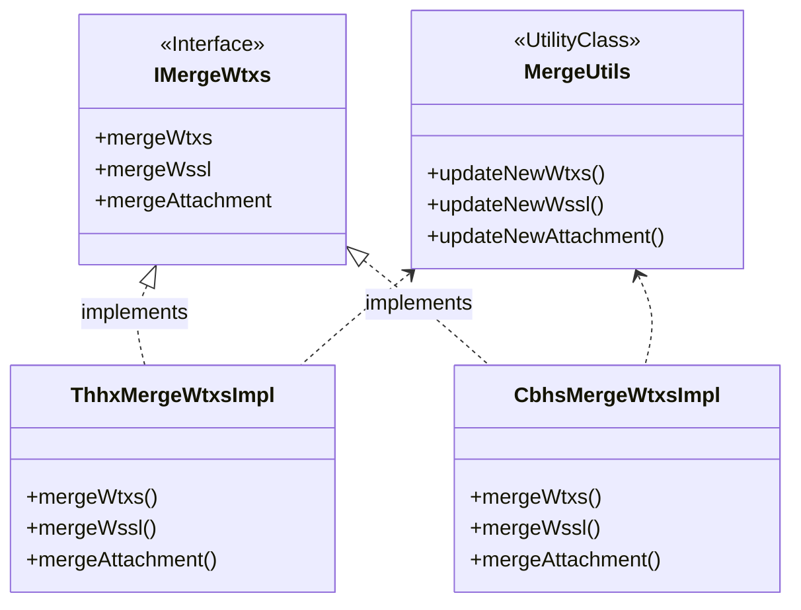

# **派驻v1.2概要设计**
>author : 孙文浩

>version : v1.2

>date : 2020-4-26
---
## 目录
- [1.需求分析](#1.需求分析)
- [2.总体设计](#2.总体设计)
    - [2.1.设计清单](#2.1.设计清单)
        - [2.1.1.谈话线索合并](#2.1.1.谈话线索合并)
        - [2.1.2.办理中转办（预留）](#2.1.2.办理中转办（预留）)
        - [2.1.3.变更处置方式（预留）](#2.1.3.变更处置方式（预留）)
    - [2.2.功能设计](#2.2.功能设计)
- [3.数据库设计](#3.数据库设计)
    - [3.1.DDL](#3.1.DDL)
        - [3.1.1.public.t_zhba_xshb](#3.1.1.public.t_zhba_xshb)
    - [3.2.DML](#3.2.DML)
        - [3.2.1.public.t_zhba_wtxs](#3.2.1.public.t_zhba_wtxs)
- [4.接口设计](#4.接口设计)
    - [4.1.查询查控对接接口](#4.1.查询查控对接接口)
    - [4.2.文书实例推送数据给文书服务](#4.2.文书实例推送数据给文书服务)
- [5.附录](#5.附录)
---
## 1.需求分析
### 1.1.需求概述
纪委监委收到反映同一人的问题线索还是比较多的，针对同一个人的多个问题线索，在线索处置或办理过程中会进行合并办理，综合分析研判，给予处分结论。

反映同一个人（线下基本通过姓名职务判断是不是同一个人）的线索，根据判断，进行合并办理，合并一般是合并个人信息和问题摘要，在办理方案里会标明有合并线索。正常会将办理结果同步一份给被合并的线索，以后通过任一个线索都能查到办理结果；
- 对于合并的线索，入卷的时候只有一个，统计是按多个线索来统计；
- 承办室一般从案管收到的是几条线索，向上反馈的时候也是几条；
- 合并后可以允许再次合并；
- 跨阶段的合并场景不多，一般都是在处置前合并。
### 1.2.合并规则
- 合并方式为线索1,线索2合并成线索3，其中合并后线索3作为一个虚拟线索存在。新线索3信息显示1和2的综合信息。
- 合并成功后原待合并线索不显示在办理中，只显示合并后的线索，新线索前面显示合并图标
- 具体线索字段合并规则可参考《字段合并规则（谈话函询初核合并）20200315 .xlsx》
- 文书材料合并：按阶段合并到一块，形式上合，不做内容上合并
- 合并后新线索的时限取待合并线索中分配承办人最早记录的值，合并原所有线索的时限与新线索的时限统一保持一致。
- 合并后的线索与正常线索一样允许被其他线索合并；
- 线索合并后不能进行拆分；
- 卷宗：合并的线索办结后，卷宗算一个（目前暂不考虑）
- 查询统计：线索合并后需要满足按其中任一个线索都能查询统计到。
### 1.3.其他需求点
- 嵌入的组件摘要编辑框，取消置灰
- 不考虑跨办理阶段的线索合并，需求层面禁止跨阶段合并
---
## 2.总体设计
### 2.1.设计清单
#### 2.1.1.谈话、函询、初核线索合并
- 合并范围参照
    - 谈话函询阶段，相关数据表
        - schema：public
            - 问题线索：t_zhba_thhx
            >取主线索记录，复制后生成新c_bh，更新c_sfhb=1
            - 被举报人：t_zhba_thhx_bjbr
            >被举报人/单位，取主线索记录，复制后生成新c_bh，更新c_ajbh对应t_zhba_thhx.c_bh
            >>涉案人员直接按记录合并，复制后生成新c_bh，更新c_ajbh对应t_zhba_thhx.c_bh
            - 举报人：t_zhba_jbr
            >直接按记录合并，复制后生成新c_bh，更新c_ajbh对应t_zhba_thhx.c_bh
            - 办理结论：t_zhba_thhx_jl
            >直接按记录合并，复制后生成新c_bh，更新c_ajbh对应t_zhba_thhx.c_bh，更新c_bjbrbh对应t_zhba_thhx_bjbr.c_bh
            - 线索摘要：t_zhba_xszy
            >直接按记录合并，复制后生成新c_bh，更新c_ajbh对应t_zhba_thhx.c_bh，更新c_bjbrbh对应t_zhba_thhx_bjbr.c_bh
            - 违纪违法：t_zhba_wjwf
            >直接按记录合并，复制后生成新c_bh，更新c_ajbh对应t_zhba_thhx.c_bh，更新c_bjbrbh对应t_zhba_thhx_bjbr.c_bh，更新c_xszybh对应t_zhba_xszy.c_bh
            - 家庭成员：t_jtcyxx
            >直接按记录合并，复制后生成新c_bh，更新c_bh_bjbr对应t_zhba_thhx_bjbr.c_bh
            - 历次任职：t_lcrzxx
            >直接按记录合并，复制后生成新c_bh，更新c_bh_bjbr对应t_zhba_thhx_bjbr.c_bh
            - 谈话情况：t_zhba_thhx_th
            >直接按记录合并，复制后生成新c_bh，更新c_thhxbh对应t_zhba_thhx.c_bh
            - 函询情况：t_zhba_thhx_hx
            >直接按记录合并，复制后生成新c_bh，更新c_thhxbh对应t_zhba_thhx.c_bh
            - 函询书面说明：复制后生成新c_bh，t_zhba_thhx_hxsmsm
            >直接按记录合并，复制后生成新c_bh，更新c_thhxbh对应t_zhba_thhx.c_bh，更新c_hxbh对应t_zhba_thhx_hx.c_bh
            - 纪律检查建议：t_zhba_jljcjcjy
            >直接按纪律合并，更新c_ajbh
            - 问责对象信息：t_zhba_wzdxxx
            >直接按记录合并，复制后生成新c_bh，更新c_ajbh对应t_zhba_thhx
            >>c_bjbrbh!=null且c_glbjbr=null，更新c_bjbrbh对应t_zhba_thhx_bjbr.c_bh
            >>>c_bjbrbh=null且c_glbjbr!=null，更新c_glbjbr对应t_zhba_thhx_bjbr.c_bh
            - 纸质文书及材料信息：t_attachment、t_attachment_detail
            >直接按记录合并
            >>t_attachment复制后生成c_bh，更新c_ajbh、c_ywbh，分别对应t_zhba_thhx.c_bh和对应子业务表的主键
            >>>t_attachment_detail复制后生成c_bh，更新c_bh_attachment对应t_attachment.c_bh
            - 文书：t_wssl
            >直接按记录合并，复制后生成新c_bh，更新c_ajbh、c_ywbh，分别对应t_zhba_thhx.c_bh和业务模块主键
            >>推送数据，通知文书服务同步复制文书
            - 审批：t_zhba_sp
            >文书审批挂接案件，对应审批不需要更新
            >>更新c_tqnr对应t_wssl.c_bh
            - 调查措施
            >在调查措施嵌入url增加传参，hbbhs（合并编号）
            >>hbbhs通过sql递归查出所有合并前的所有线索编号，用“;”拼接
            - 分配承办人：t_zhba_cbr_ba
            >合并后的新线索，默认分配原线索的承办人
    - 初步核实阶段，相关数据表
        - schema：public
            - 问题线索：t_zhba_cbhs
            >取主线索记录，复制后生成新c_bh，更新c_sfhb=1
            - 被举报人：t_cbhs_bjbr
            >被举报人/单位，取主线索记录，复制后生成新c_bh，更新c_ajbh对应t_zhba_chbs.c_bh
            >>涉案人员直接按记录合并，复制后生成新c_bh，更新c_ajbh对应t_zhba_chbs.c_bh
            - 举报人：t_jbr
            >直接按记录合并，复制后生成新c_bh，更新c_ajbh对应t_zhba_chbs.c_bh
            - 办理结论：t_zhba_cbhs_jl
            >直接按记录合并，复制后生成新c_bh，更新c_ajbh对应t_zhba_chbs.c_bh，更新c_bjbrbh对应t_zhba_chbs_bjbr.c_bh
            - 线索摘要：t_zhba_xszy
            >直接按记录合并，复制后生成新c_bh，更新c_ajbh对应t_zhba_chbs.c_bh，更新c_bjbrbh对应t_zhba_chbs_bjbr.c_bh
            - 违纪违法：t_zhba_wjwf
            >直接按记录合并，复制后生成新c_bh，更新c_ajbh对应t_zhba_chbs.c_bh，更新c_bjbrbh对应t_zhba_chbs_bjbr.c_bh，更新c_xszybh对应t_zhba_xszy.c_bh
            - 家庭成员：t_jtcyxx
            >直接按记录合并，复制后生成新c_bh，更新c_bh_bjbr对应t_zhba_chbs_bjbr.c_bh
            - 历次任职：t_lcrzxx
            >直接按记录合并，复制后生成新c_bh，更新c_bh_bjbr对应t_zhba_chbs_bjbr.c_bh
            - 初步核实情况：t_zhba_cbhs_cbhsqk
            >直接按记录合并，复制后生成新c_bh，更新c_ajbh对应t_zhba_chbs.c_bh，更新c_bjbrbh对应t_zhba_chbs_bjbr.c_bh
            - 纪律检查建议：t_zhba_jljcjcjy
            >直接按纪律合并，更新c_ajbh
            - 问责对象信息：t_zhba_wzdxxx
            >直接按记录合并，复制后生成新c_bh，更新c_ajbh对应t_zhba_chbs
            >>c_bjbrbh!=null且c_glbjbr=null，更新c_bjbrbh对应t_zhba_chbs_bjbr.c_bh
            >>>c_bjbrbh=null且c_glbjbr!=null，更新c_glbjbr对应t_zhba_chbs_bjbr.c_bh
            - 纸质文书及材料信息：t_attachment、t_attachment_detail
            >直接按记录合并
            >>t_attachment复制后生成c_bh，更新c_ajbh、c_ywbh，分别对应t_zhba_thhx.c_bh和对应子业务表的主键
            >>>t_attachment_detail复制后生成c_bh，更新c_bh_attachment对应t_attachment.c_bh
            - 文书：t_wssl
            >直接按记录合并，复制后生成新c_bh，更新c_ajbh、c_ywbh，分别对应t_zhba_thhx.c_bh和业务模块主键
            >>推送数据，通知文书服务同步复制文书
            - 审批：t_zhba_sp
            >文书审批挂接案件，对应审批不需要更新
            >>更新c_tqnr对应t_wssl.c_bh
            - 调查措施
            >在调查措施嵌入url增加传参，hbbhs（合并编号）
            >>hbbhs通过sql递归查出所有合并前的所有线索编号，用“;”拼接
            - 分配承办人：t_zhba_cbr_ba
            >合并后的新线索，默认分配原线索的承办人
- 线索合并规则
    - 只有承办人完全一致才可合并
        - 当前阶段承办人，在t_zhba_cbr_ba表中记录的所属承办人id一致，即视为可合并
        - 合并后在t_zhba_cbr_ba表中新增合并线索承办人
        - 通知分配承办人服务，为新增合并线索分配承办人，承办人为被合并线索的承办人
    - 合并后新线索的“问题线索基本信息、被反映人信息、当前办理阶段信息”将会覆盖，取值为主线索对应信息。
        - 取主线索记录，通过springframework的BeanUtils.copyProperties()复制JavaBean
    - 合并后新线索的“谈话编号、函询编号、初核编号”取值为主线索对应编号。
    - 合并后新线索的“问题线索摘要、文书、材料”显示所有待合并线索的的合集。
        - 线索摘要：
        
                线索摘要绑定被举报人，复制合并后更新t_zhba_xszy.c_bjbrbh

                同步复制更新关联字段：
                表关系：
                    1. wtxs -> bjbr(c_ajbh) -> xszy(c_xsbh) -> wjwf(c_xszybh)
                    2. thhx -> bjbr(c_ajbh) -> thhx_jl(c_bjbrbh) -> xszy(c_xsbh) -> wjwf(c_xszybh)
                    3. cbhs -> bjbr(c_ajbh) -> cbhs_cbhsqk(c_bjbrbh) -> xszy(c_xsbh) -> wjwf(c_xszybh)
                    4. lasc -> bdcr(c_ajbh) -> xszy(c_xsbh) -> wjwf(c_xszybh)


                bjbr表:复制后生成新c_bh，更新c_ajbh对应wtxs表
                xszy表：复制后生成新c_bh，更新c_bjbrbh对应bjbr表，更新c_xsbh对应wtxs表
                jl表：复制后生成新c_bh，更新c_ajbh对应wtxs表，更新c_xszybh对应xszy表
                wjwf表：复制后生成新c_bh，更新c_ajbh对应wtxs表，更新c_bjbrbh对应bjbr表，更新c_xszybh对应xszy表
        - 文书：
            
                文书绑定问题线索，复制合并后更新t_wssl.c_ajbh和t_wssl.c_ywbh
        - 附件：
        
                附件绑定问题线索或子模块业务，复制合并后更新t_attachment.c_ajbh、t_attachment.c_ywbh、t_attachment.c_bh
                同步复制更新关联字段：t_attachment->t_attachment_detail
                attachment表：生成新c_bh，更新c_ajbh、c_ywbh，分别对应问题线索编号、附件所属模块业务编号
                attachment_detail表：生成新c_bh，更新c_bh_attahment
    - 合并后新线索的所有前置办理环节的信息会全部保留，显示所有待合并线索的合集。
    - 合并后新线索生成一个新的“问题线索编号”，编号前面会显示一个“合”的图标。
        - 通过c_sfhb字段控制展示，该字段在合并生成新线索时插入"1"(是)，该字段需要跟随线索流转
    - 具体参考《字段合并规则-20200329.xlsx》
    - 具体校验设计参考[2.2.功能设计](#2.2.功能设计)
    - 合并后的新线索，开启新的时限
#### 2.1.2.办理中转办（预留）
- 考虑复用派驻案管转办调用的接口

#### 2.1.3.变更处置方式（预留）
- 重新设计变更处置方式表，添加增量设计
### 2.2.功能设计
>线索合并，触发在a5，合并操作在api
- 接口及实现类

- 根据案件类别（ajlb）区分谈话函询、初步核实
    - 谈话函询：302
    - 初步核实：303
- 线索合并页面
    - 参照办案页面
    - 待合并列表查询
        - 需求层面禁止了跨办理阶段的合并，默认都在同办理阶段合并
        - 通过姓名+职务（group by）且count（姓名）>1，过滤出结果集，再按分配承办人日期降序排列
    - 合并校验提示参考需求文档


- 合并前置校验
    - 派驻执纪接口类：ICheckBeforeMerge
        - 谈话函询校验类：ThhxCheckBeforeMergeImpl
        - 初步核实校验类：CbhsCheckBeforeMergeImpl
        - 接口方法：
                
                校验提示：
                                public String checkResult(String ajbh){
                                    StingBuilder.append(checkCbrResult);
                                    StingBuilder.append(checkSpResult);
                                }
                校验承办人：    public String checkCbr(String ajbh)
                校验审批：      public String checkSp(String ywbh)
- 线索合并
    - 派驻执纪接口类：IMergeWtxs
        ```java
        public interface IMergeWtxs(){
            /**
            *线索合并
            */
            void mergeWtxs(List<String> ajbhList);

            /**
            *文书合并
            *1.无子业务直接更新ajbh
            *2.有子业务，除了更新ajbh之外，还要更新对应ywbh
            *3.合并后的通知文书服务复制文书
            */
            void mergeWssl(List<String> ajbhList);

            /**
            *附件合并
            *1.无子业务直接更新ajbh
            *2.有子业务，除了更新ajbh之外，还要更新对应ywbh
            */
            void mergeAttachment(List<String> ajbhList);

        }
        ```
        - 谈话函询线索合并：ThhxMergeWtxsImpl
        ```java
        public class ThhxMergeWtxsImpl implements IMergeWtxs(){
            @Override
            void mergeWtxs(List<String> ajbhList){
                queryAndCopyTableDatas();
                /**
                *更新谈话函询阶段独有数据表
                */
                updataNewThhx();
                updateNewWtxs();
                InsertTZhbaXshb();
                startTimeLimit();
            }

            @Override
            void mergeWssl(List<String> ajbhList){
                queryAndCopyTableDatas();
                updateNewWssl();
            }

            @Override
            void mergeAttachment(List<String> ajbhList){
                queryAndCopyTableDatas();
                updateNewAttachment();
            }
        }
        ```
        - 初步核实线索合并：CbhsMergeWtxsImpl
        ```java
        public class CbhsMergeWtxsImpl implements IMergeWtxs(){
            @Override
            void mergeWtxs(List<String> ajbhList){
                queryAndCopyTableDatas();
                /**
                *更新初步核实阶段独有数据表
                */
                updataNewThhx();
                updateNewWtxs();
                InsertTZhbaXshb();
                startTimeLimit();
            }

            @Override
            void mergeWssl(List<String> ajbhList){
                queryAndCopyTableDatas();
                updateNewWssl();
            }

            @Override
            void mergeAttachment(List<String> ajbhList){
                queryAndCopyTableDatas();
                updateNewAttachment();
            }
        }
        ```
    - 派驻案管接口类：IMergeWtxs
        - 线索管理阶段合并：MergeWtxsImpl
    - 公共方法提取
        ```java
        @UtilityClass
        public class MergeUtils{
            public void updateNewWtxs(List<Map> map){}
            public void updateNewWssl(List<Map> map){}
            public void updateNewAttachment(List<Map> map){}
        }
        ```
        - 线索主表及相关表合并,查询后复制更新处理
        ```java
        /**
        *针对更新逻辑相同的几张表：
        *1.t_zhba_jbr
        *2.t_zhba_xszy
        *3.t_zhba_wjwf
        *4.t_zhba_wzdxxx
        *5.t_jtcyxx
        *6.t_lcrzxx
        *@Param map 原编号s和新编号s
        */
        public void updateNewWtxs(List<Map> map){
            updateJbr();
            updateXszy();
            updateWjwf();
            updateWzdxxx();
            updateJtcyxx();
            updateLcrzxx();
            updateJljcjcjy();
        }
        ```
        - 文书合并，查询后复制更新处理
        ```java
        public void updateNewWssl(List<Map> map){
            updateWssl();
            /**
            *调用文书接口，合并文书
            */
            noticeZnws();
        }
        ```
        - 附件合并,查询后复制更新处理
        ```java
        public void updateNewAttachment(List<Map> map){
            updateAttachment();
            updateAttachmentDetail();
        }
        ```
    - 合并操作需要同步插入t_zhba_xshb
- 调查措施参数递归查询
    ```sql
    WITH RECURSIVE temp_xshb AS (
	SELECT
		c_yajbh,
		c_xajbh
	FROM
		t_zhba_xshb xshb
	WHERE
		c_xajbh = #{ xajbh,
		jdbcType = VARCHAR }
	UNION ALL
		SELECT
			xshb.c_yajbh,
			xshb.c_xajbh
		FROM
			t_zhba_xshb xshb,
			temp_xshb
		WHERE
			xshb.c_xajbh = temp_xshb.c_yajbh
    ) 
    
    
    
    SELECT
    c_yajbh
    FROM
    temp_xshb
    ORDER BY
    c_xajbh
    ```
---
## 3.数据库设计
### 3.1.DDL
#### 3.1.1.public.t_zhba_xshb
>新增线索合并表，用于详情查询合并前的案件阶段信息

|字段|字段注释|字段类型/字段长度|是否主键|是否外键|
|---|---|---|:---:|:---:|
|c_bh		|主键		|varchar(32)	|	是	|	|
|c_yajbh	|原案件编号	|varchar(32)	|		|是	|
|c_xajbh	|新案件编号	|varchar(32)	|		|是	|
|c_yxsh		|原线索号	|varchar(300)	|		|	|
|c_xxsh		|新线索号	|varchar(300)	|		|	|
|c_yajbs	|原案件标识	|varchar(32)	|		|	|
|c_xajbs	|新案件标识	|varchar(32)	|		|	|
|c_yajlb	|原案件类别	|varchar(100)	|		|	|
|c_xajlb	|新案件类别	|varchar(100)	|		|	|
|c_czr	    |操作人     |varchar(300)	|		|	|
|dt_cjsj	|创建时间	|timestamp(6)	|		|	|
|dt_zhgxsj	|最后更新时间	|timestamp(6)   |		|	|
|c_major	|是否为主线索, "1"为主线索	|varchar(100)   |		|	|
|c_thhx	|2：谈话，3：函询|varchar(100)   |		|	|
### 3.2.DML
#### 3.2.1.public.t_zhba_wtxs
|字段|字段注释|字段类型/字段长度|是否主键|是否外键|
|---|---|---|:---:|:---:|
|c_sfhb|是否合并，用于列表“合”字展示等的标记|varchar(100)|
---
## 4.接口设计
### 4.1.查询查控对接接口
>接口说明：获取该线索是否使用了查询或者冻结措施，沿用办案的对接方式
- Request

        POST    http://ip:port/api/v1/getCxckZt/{Xsh}

    |参数|参数说明|是否必填|
    |---|---|:---:|
    |Xsh|谈话或者初步核实编号|是|
### 4.2.文书实例推送数据给文书服务
>接口说明：合并文书时，通知文书生成对应复制的文书
- Request

        POST http://ip:port//api/v1/wsslCopy
    - 请求体
    ```json
    [{
        "ywsid":"原文书id",
        "xwsid":"新文书id",
        "ajbh":"新业务编号"
    },{}
    ]
    ```
    |参数|参数说明|是否必填|
    |---|---|:---:|
    |ywsid|原文书id|是|
    |xwsid|新文书id|是|
    |ajbh|新业务编号|是|
### 4.3.触发合并接口
>接口说明：具体合并操作走api后台，a5只做触发
- Request

        POST http://ip:port//api/wtxshb/v1/xshb
    - 请求体
    ```json
    {
        "ajjd":"302",
        “zajbh":"uuid1",
        "hbbhList":["uuid1","uuid2","uuid3"]
    }
    ```
    ```java
    public class HbRequestData {
        /**
        * 案件阶段
        */
        private String ajjd;
        /**
        *主案件编号
        */
        private String zajbh;
        /**
        * 合并编号列表
        */
        private List<String> hbbhList;
    }
    ```
    
---
## 5.附录